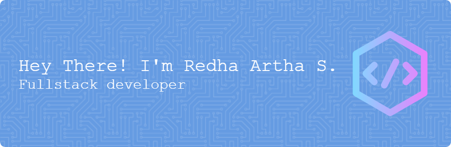

  

###

  
  

###

  

###

<h3 align="left">👩‍💻  About Me</h3>

###

I'm Redha Artha S from Tuban City, Jawa Timur, Indonesia  I am a Software Engineering Vocational School graduate currently pursuing ASTRA-certified Fullstack Developer training at UTSchool. I possess the skills to implement features on websites and mobile applications, and have participated in real projects at my internship and at PT. United Tractors, providing me with the basics of fullstack web development and a quick grasp of new concepts, all of which are relevant to my field.

###

<h3 align="left">🛠 Language and tools</h3>

###

  
  
  
  
  
  
  
  
  
  
  
  
  
  
  
  
  
  
  
  
  
  
  
  
  
  
  
  
  
  
  
  
  
  
  
  
  
  
  
  
  
  
  
  
  
  
  
  
  
  
  
  
  
  
  
  
  
  
  
  
  
  
  
  
  
  
  
  
  
  
  
  
  
  
  
  
  
  
  

###

  
  
  
  
  

###

<picture>
  <source media="(prefers-color-scheme: dark)" srcset="https://raw.githubusercontent.com/redha86/redha86/output/pacman-contribution-graph-dark.svg">
  <source media="(prefers-color-scheme: light)" srcset="https://raw.githubusercontent.com/redha86/redha86/output/pacman-contribution-graph.svg">
  
</picture>

###